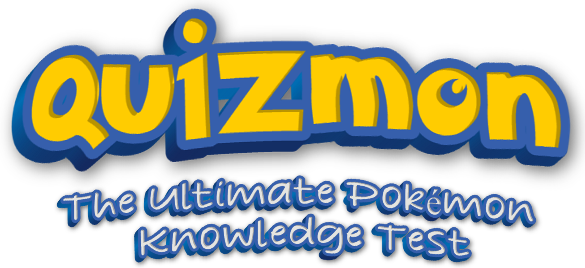

<p align="center">
  
</p>

<p align="center">
  <a href="https://quizmon.raveh.dev/">Play Quizmon</a>
</p>

Quizmon is a quick browser game about Pokémon sprites, descriptions, types, matchups, abilities, moves, evolutions, stats,
size, and identity across Generations I through IX.

- Play the daily challenge. You get
  one attempt, saved in your browser.
- Play custom games around the generations and topics you want.
- Finish with a progressive-clue question worth more when you solve it
  early.

## Run Quizmon locally

[mise](https://mise.jdx.dev/) installs the pinned tools and exposes one setup task
for a fresh clone:

```sh
mise run setup
npm run dev
```

## Pokémon data

Quizmon builds a versioned catalog from [PokéAPI](https://pokeapi.co/) and ships it
as a hashed static asset. Live rounds do not call the PokéAPI service. They load
the catalog and classic sprite images directly, so the game needs no account or
application backend. Settings, daily results, and Training bests stay in browser
storage.

Refresh the checked-in catalog with:

```sh
npm run data:update
```

The wordmark was made with [TextStudio](https://www.textstudio.co).

Quizmon is not
affiliated with Nintendo, Game Freak, or The Pokémon Company. Pokémon and related
trademarks belong to their respective owners.

## License

Quizmon is available under the [MIT License](LICENSE).
